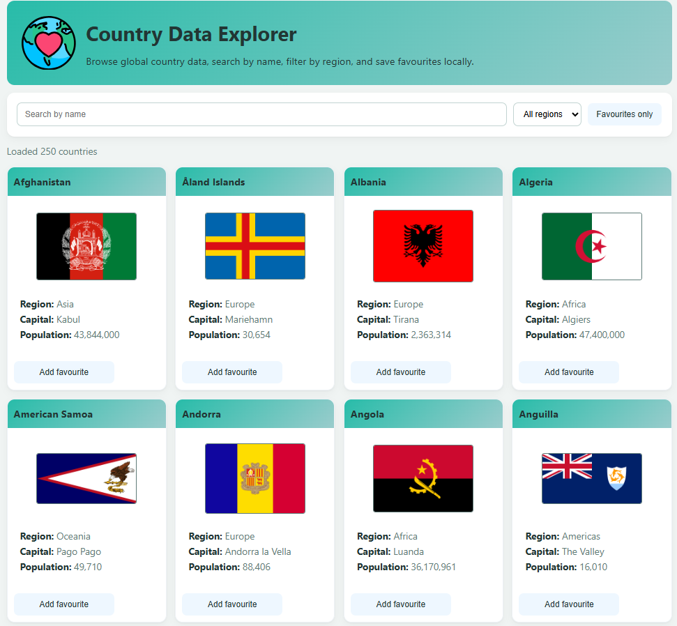
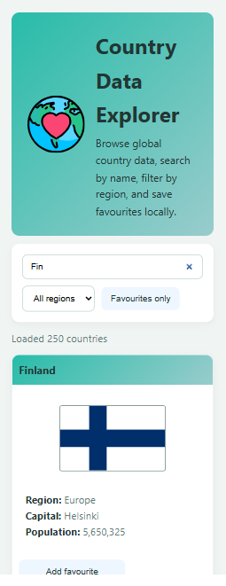
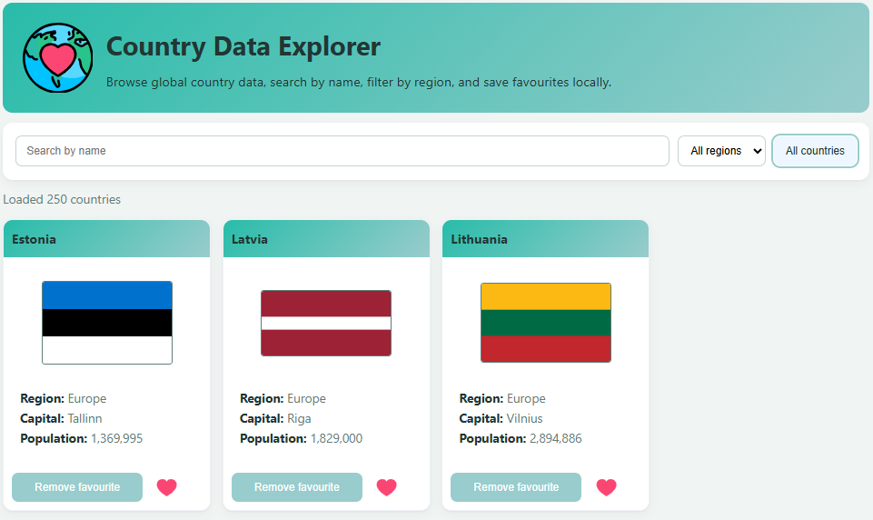

# 🌍 Project-1-Country-Data-Explorer SPA

A single-page application that fetches public country data from [REST Countries] (https://restcountries.com), allowing users to:
- 🔍 Search by country name
- 🌐 Filter by region
- 📇 View detailed country cards
- ❤️ Mark favourites

**Key Features**
- **Fetch & Display:** Loads country data from `https://restcountries.com` without an API key and displays results as cards.
- **Search:** Instant client-side search by country name.
- **Region Filter:** Filter results by region (Africa, Americas, Asia, Europe, Oceania).
- **Favourites:** Toggle favourites per country; state persists in `localStorage` across refreshes.
- **Accessible UI:** Semantic HTML, visible focus styles, and screen-reader labels for key controls.
- **Responsive Layout:** Grid layout adapts from mobile to desktop.

## Live site

Render: https://project-1-country-data-explorer.onrender.com/

## Repository

GitHub: https://github.com/DaigaTahkapaa/Project-1-Country-Data-Explorer

## Demo video

Hosted: [Project-1-Country-Data-Explorer-Video](https://laureauas-my.sharepoint.com/:v:/g/personal/dat00012_laurea_fi/IQBE7mm64JrUQJgcudb3R_sDAWzBqScWzjZe63B61HhemXY?nav=eyJyZWZlcnJhbEluZm8iOnsicmVmZXJyYWxBcHAiOiJPbmVEcml2ZUZvckJ1c2luZXNzIiwicmVmZXJyYWxBcHBQbGF0Zm9ybSI6IldlYiIsInJlZmVycmFsTW9kZSI6InZpZXciLCJyZWZlcnJhbFZpZXciOiJNeUZpbGVzTGlua0NvcHkifX0&e=t9oKKN)

Timestamps:
00:00 Intro 
00:59 Project Overview
01:46 Demo 
03:59 Conclusion 

## How to run locally

Step 1 — get the repository URL

- Open the project GitHub page: https://github.com/DaigaTahkapaa/Project-1-Country-Data-Explorer
- Click **Code** → **HTTPS** and copy the URL.

Step 2 — open a terminal and choose a folder

Windows (PowerShell / Command Prompt):

```powershell
# change to the folder where you keep projects
cd C:\path\to\your\projects
```

macOS (Terminal):

```bash
# change to the folder where you keep projects
cd ~/Documents/projects
```

Step 3 — clone the repository

```bash
git clone https://github.com/DaigaTahkapaa/Project-1-Country-Data-Explorer.git
```

This creates a folder named `Project-1-Country-Data-Explorer` with the project files.

Step 4 — open the project

Option A — VS Code (recommended for editing):

```bash
cd Project-1-Country-Data-Explorer
code .
```

If `code .` doesn't work, enable the "Command Line" tool in VS Code: open the Command Palette (Ctrl/Cmd+Shift+P) and run `Shell Command: Install 'code' command in PATH`.

Option B — Quick preview without an editor:

- Open the `Project-1-Country-Data-Explorer` folder in your file manager and double-click `index.html` to open it in the browser. (Note: some browser features require serving over `http://` rather than `file://`.)

Optional — Live reload while editing (VS Code Live Server)

- Install the **Live Server** extension in VS Code.
- With the project open, right-click `index.html` → **Open with Live Server**. The extension usually serves at `http://127.0.0.1:5500`.

## Screenshots

Place screenshots in a `screenshots/` folder. Replace the placeholders below with real captures:






## Project structure (key files)
- `index.html` — page shell
- `styles.css` — styles and variables
- `app.js` — fetch, filtering, rendering, favourites

```
project-1-country-data-explorer/
├── index.html
├── style.css
└── app.js
```

---

## Self-assessment (Canvas rubric)

### A. Core Functionality (10 points)
- Primary user stories run end-to-end: Search, filter, card display, and favourites work. (4/4)
- Error handling: network errors and empty-results show messages, implemented as provided by assignment (2/2)
- State & navigation: favourites persist across refreshes; filter/search state is not persisted (not required by assignment). (2/2)
- Loading & empty states: loading message and no-results message are shown. (2/2)

**Score:** 10 / 10 — excellent core behaviour; optional enhancements suggested but not required.

### B. Code Quality and Architecture (5 points)
- Separation of concerns: `app.js` functions are focused; styles live in `styles.css`. (2/2)
- Naming & comments: mostly clear; improvements always possible. Likely over-commented for none-beginners (0.75/1)
- Formatting & linting: Code formatted using Prettier - Code formatter extention in VS Code, could not make ESLint and Prettier (0.75/1) to work
- Defensive coding: fetch wrapped in try/catch; some null-checks present. (1/1)

**Score:** 4.5 / 5

### C. UX and Accessibility (5 points)
- Responsive layout works across common widths. (1/1)
- Keyboard support and visible focus styles implemented. (1/1)
- Form usability: inputs have labels and placeholders (0.75/1)
- Contrast & semantics: headings/landmarks used. (1/1)
- Perceived performance: loading messsage present; no skeletons; no layout shifts. (1/1)

**Score:** 4.75 / 5

### D. Data Handling and Persistence (4 points)
- `localStorage` used with sensible defaults. (1/1)
- Schema awareness: received api data normalized and restructured before use (1/1)
- Security: - not accepting user-generated input to update innerHTML anywhere, user just filters pre-loaded data. - REST Countries API is trusted and curated. Could still see if .innerHTML could be replaced with .textContent  (0.75/1)
- Resilience: try/catch for network operations. (1/1)

**Score:** 3.75 / 4

### E. Documentation (3 points)
- README includes run steps, feature list, and screenshots. (1/1)
- Architecture and limitations explained. (1/1)
- Reflection & self-assessment provided. (1/1)

**Score:** 3 / 3 minus 15% for submitting late = 2.55

### F. Deployment (3 points)
- Live URL available and reachable. (1/1)
- README links to live site and repo. (1/1)
- Release/CI: no release tag or CI configured. (0/1)

**Score:** 2 / 3 minus 10% for submitting late = 1.8

### G. Demo Video & Project Documentation on Git (5 points)
- Problem/solution documented in README. (2/2)
- Key flows with ons screen results shown (1/1)
- Reflection: key learnings and next steps present. (1/1)
- Delivery: link in README. (1/1)

**Score:** 5 / 5 minus 20 % for submitting late = 4

**Total self-assessment:**  32 / 35

---

## Reflection 

Working on the Country Data Explorer helped practice several basic front-end skills. One important part was learning how to fetch data from an external source—restcountries.com—and make sure the app doesn’t break if the data isn’t perfect. For example, some countries don’t have a capital listed, or the capital is given as an array instead of a single word. Through this, I learned a useful term: defensive data handling—which basically means making sure the app still works even if the data is incomplete, missing, or formatted in unexpected ways.
Reading through the provided code helped me understand how data flows through a web app. The app first fetches country data, then cleans it up, stores it, filters it based on user input, and finally shows the results on the page. 
The favourites feature uses localStorage to remember which countries were marked. I learned that keeping this saved data simple—just a list of country codes with true values—makes it easier to manage and avoids problems later if the app changes. 
Accessibility and user experience were part of the project goals. Virtually all my previous learning I have been mostly focusing on functions/logic, and now I'm learning more about accessibility. One new thing I hadn’t used before was the `sr-only` class—it hides text visually but still makes it readable for screen readers. That felt like a step beyond just writing working code—it’s about making the app usable for more people.
If I had more time to keep improving the project, I’d make a few upgrades: 
1. I’d replace the remaining innerHTML with safer ways to build the page using direct DOM methods—this helps avoid security issues like script injection (which should not be an issue for this project where all the country data is pre-loaded, and trusted API used)
2.  I’d save the search and filter choices in sessionStorage, so they don’t reset when the page reloads. 
3.  I’d find a way on how to make linting and CI work so that the code would be automatically checked for errors and deployed whenever I make changes.
This has been a valuable learning experience, but also quite overwhelming at times. Thinking about layout, HTML structure, JavaScript logic, accessibility, security, and even continuous integration feels like a lot for one person to handle—especially as a beginner. 
But hey, maybe with enough practice, it’ll all become second nature someday.


